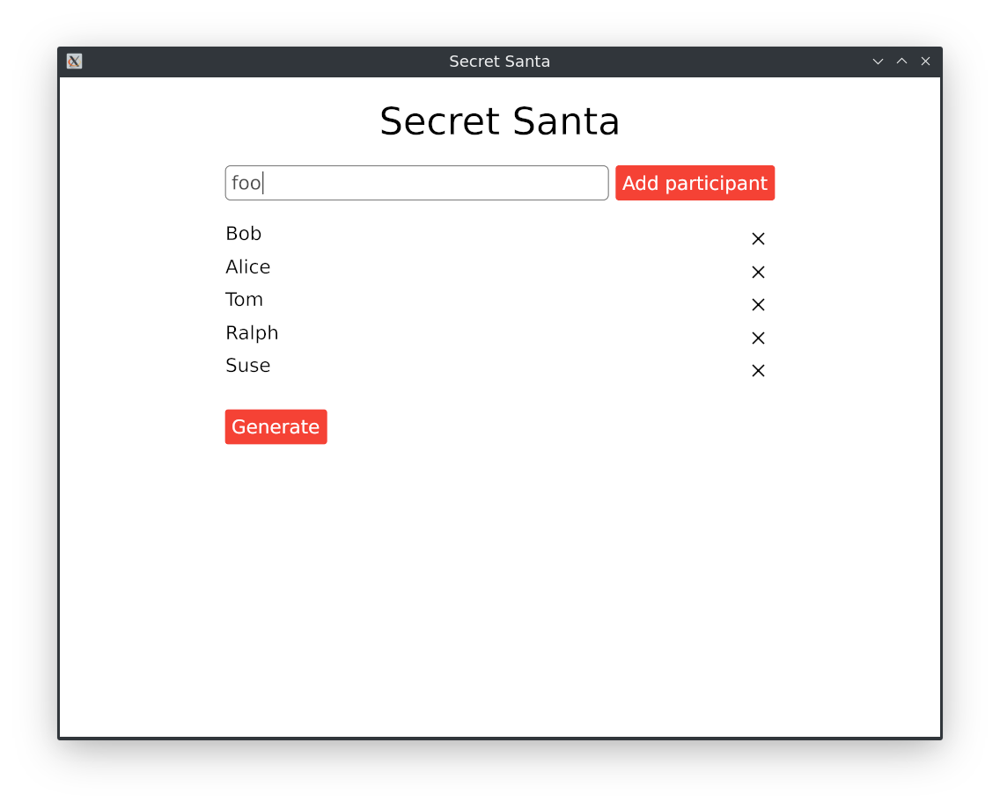
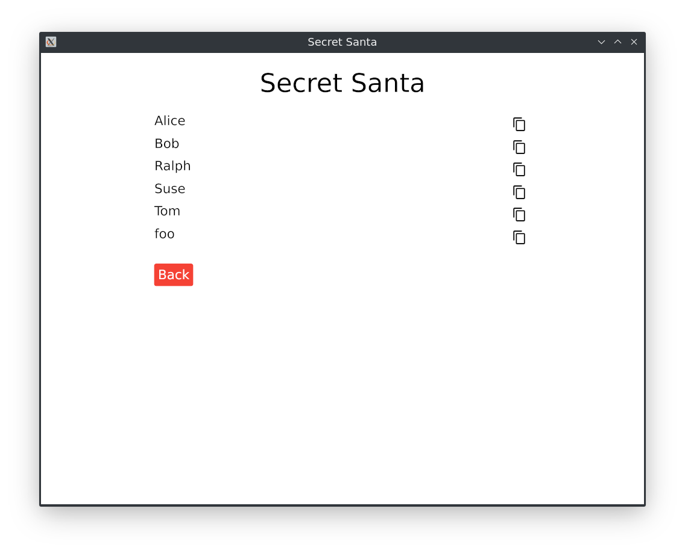

# iced-secret-santa
Cross-platform secret santa app written with [iced](https://github.com/hecrj/iced) framework. Generates an URL with a gift recipient for each participant added to the list.

# Todo
- Come up with a better design.
- Improve URLs: base64 does not hide names well.
